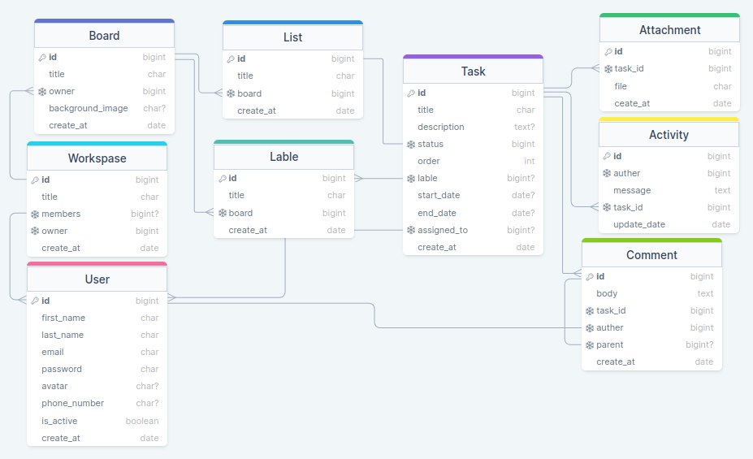

# Trello Project

This project is a Trello clone built with Django and Django REST Framework. It allows users to create boards, lists, and cards, and to collaborate with others on those items.

## Requirements

To run this project, you will need:

- Python 3.9 or higher
- Other dependencies listed in requirements.txt file

## Features

This project includes the following features:

- Workspace creation: Users can create new workspaces and add othe users as teammates.
- Board creation: Users can create new boards and customize them with a title and background image.
- List creation: Within each board, users can create lists to organize cards.
- Card creation: Users can create new cards within each list and add a title, description, and due date.
<!-- - Drag-and-drop interface: Cards can be moved between lists and reordered within a list. -->
- Collaborators: Users can add other users to a board as collaborators, allowing them to view and edit the board's contents.
- REST API: The project includes a REST API that allows users to create, read, update, and delete boards, lists, and cards.

## Installation

To install this project, follow these steps:

1. Clone the repository to your local machine: `git clone git@github.com:ata-the-legend/Trello-Project.git`
2. Navigate to the project directory: `cd Trello-Project`
3. Create a virtual environment: `python3 -m venv env`
4. Activate the virtual environment: `source env/bin/activate`
5. Install the project dependencies: `pip install -r requirements.txt`
6. Run the migration: `python manage.py migrate`
7. Start the development server: `python manage.py runserver`

## ERD Diagram

Here's an ERD diagram that illustrates the database schema for this project:

## Usage

To use the project, open a web browser and navigate to `http://127.0.0.1:8000/`. From there, you can create boards, lists, and cards, and collaborate with others on those items.

The API endpoint is available at `http://127.0.0.1:8000/api/`. You can use this endpoint to perform CRUD operations on boards, lists, and cards.

## Contribution Guidelines

If you would like to contribute to this project, follow these guidelines:

1. Fork the repository to your own account.
2. Create a new branch: `git checkout -b your-branch-name`
3. Make your changes and commit them: `git commit -m "Your commit message here"`
4. Push your changes to your fork: `git push origin your-branch-name`
5. Submit a pull request to the main repository.

## License

This project is licensed under the MIT License. See the `LICENSE` file for details.